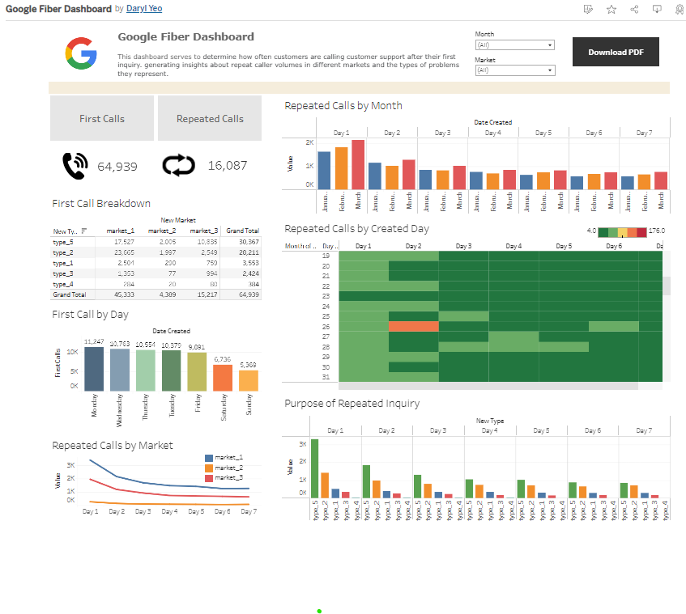

# Google-Fiber-Project

Hello there! I undertook this project as part of the Google Business Intelligence Professional Certificate. 

## Background

Google Fiber provides people and businesses with fiber optic internet. Currently, the customer service team working in their call centers answers calls from customers in their established service areas. In this project, my role as the BI Analyst involves exploring trends in repeat calls to reduce the number of times customers have to call in order for an issue to be resolved.

## Project Planning

To identify key metrics and dashboard requirements, I created 3 key project planning documents: 
* Stakeholder requirements document.
* Project requirements document.
* Strategy document. 

The documents have been attached to this repo for your viewing. 

## Data Extraction

This BI course introduces the concepts of Extract, Transform and Load (ETL) and the use of Google DataFlow to achieve this. 

For this step, I have been provided datasets for 3 different markets in csv format and I decided to join them using Google BigQuery. 

```
SELECT *
FROM `bi-project-bigquery.fibre.market_1`
UNION ALL
SELECT *
FROM`bi-project-bigquery.fibre.market_2`
UNION ALL
SELECT *
FROM `bi-project-bigquery.fibre.market_3`
```

As the data had been previously cleaned, the target table is created and ready. This step also represents the Extract phase of the ETL pipeline. 

## Data Visualization



You may access the dashoard [here](https://public.tableau.com/views/GoogleFiberDashboard_17271493658170/Dashboard2?:language=en-US&:sid=&:redirect=auth&:display_count=n&:origin=viz_share_link).

This dashboard allows for effective monitoring and addresses the stakeholder needs:

* Help them understand how often customers are calling customer support after their first inquiry.
* Provide insights into the types of customer issues that seem to generate more repeat calls.
* Explore repeat caller trends in the three different market cities.
* Design charts so that stakeholders can view trends by different timeframes.

### Dashboard Summary

* The number of first calls & repeated calls are highlighted at the top left of the dashboard to provide an overall understanding of the first:repeated ratio by month & market.  
* Below that, a table-formatted breakdown of the first calls indicate top reasons for the first calls.
* The first call breakdown by day highlights that most complains come in on Monday, with Sunday generally a slow day.
* The remaining charts examine the repeated calls by timeframe, purpose of inquiry, and by market.

*If you've read till here, I thank you for your time. And if you would like to join me on my Data Analytics journey, feel free to check out my other projects!*  

